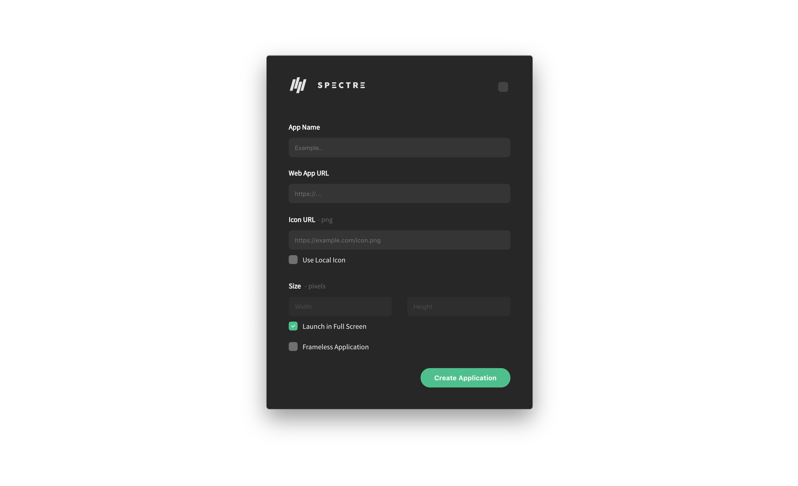

## What is Spectre

_Spectre_ is a software that allows you to **create desktop applications for any web applications**, on Mac OSX. :fire:

> It comes with an [Application](https://github.com/vbuzzegoli/spectre-dist/raw/master/Spectre.zip) and a [CLI (Command Line Interface)](https://github.com/vbuzzegoli/spectre-engine) that allows you to configure and build these applications dynamically.

## How to use



- **[DOWNLOAD APPLICATION HERE](https://github.com/vbuzzegoli/spectre-dist/raw/master/Spectre.zip)** _- v1.1.0-beta_
- Unzip the compressed file by double-clicking on it
- Move the newly uncompressed `Spectre.app` to your _Applications_ folder
- **Important: You may need to authorize Spectre.** Double-click on the app to open it, the application will likely be blocked as is a third party application. Once blocked, open `System Preferences`, click on `Security & Privacy` (`General` tab), and click on `Open Anyway`. You will not have to repeat these steps anymore.

That's it. :raised_hands:

You can now **make any web application and desktop application**.

### For Developers

#### Installation

To clone and run this repository you'll need [Git](https://git-scm.com) and [Node.js](https://nodejs.org/en/download/) (which comes with [npm](http://npmjs.com)) installed on your computer.

From your [command line](https://www.wikihow.com/Get-to-the-Command-Line-on-a-Mac):

```bash
# Move to the directory where you want to clone Spectre
cd ~/Documents

# Clone this project and install it
git clone https://github.com/vbuzzegoli/spectre.git && cd ./spectre && npm install
```

#### Usage

From your [command line](https://www.wikihow.com/Get-to-the-Command-Line-on-a-Mac):

```bash
# Move to the directory where you installed Spectre
cd ~/Documents/spectre

# Run the application
npm run dev
```

> Note: sandboxed environment may differ in access and behavior compared to the built/distributed version

#### Build

From your [command line](https://www.wikihow.com/Get-to-the-Command-Line-on-a-Mac):

```bash
# Move to the directory where you installed Spectre
cd ~/Documents/spectre

# Build the application and launch it
npm run build && open ~/Documents/spectre/dist/Spectre-darwin-x64/Spectre.app
```

## Examples

Here is a list of amazing web apps that could use a desktop application, to get you started. **These frequently used web apps are already preset for you within _Spectre_**, so you can generate them right away without looking for links. Just use one of these names and the CLI will automatically set things up for you.

- **Facebook**
- **Messenger**
- **Twitter**
- **Youtube**
- **Instagram**
- **Reddit**
- **Twitch**
- **LinkedIn**
- **Soundcloud**
- **Vimeo**
- **Gmail**
- **Coinbase**
- **Stack-Overflow**
- **GitHub**
- **Bitbucket**
- **Firebase**
- **Behance**
- **Dribbble**
- **NY-Times**
- **Rolling-Stone**

> We wanna hear about your favorite apps! [@victorbuzzegoli](https://twitter.com/victorbuzzegoli)

> Important: Names are case-sentive and should not contain spaces or any symbols other than dashes (-).

## Support

This project is open-source, meaning it is distributed free of charge to the community, and _you_ decide what contribution you want to make.

Any contribution is greatly appreciated :heart: - whether it is **sharing this project** with the people around you, or making a **donation** to support this project.

You can make a _donation_ using the following information/links:  

- Paypal: [paypal.me/victorbuzzegoli](https://www.paypal.com/paypalme2/victorbuzzegoli)
- Venmo: [@Victor-Buzzegoli](https://venmo.com/code?user_id=2638020016603136260)
- Yelle/QuickPay: vbuzze@gmail.com
- Messenger: [vbuzzegoli](https://www.messenger.com/t/vbuzzegoli)
- Bitcoin: 1BMMmQfcLhYGS2enFzS6h91zJnZEUekdi4
- Ethereum: 0x87626eD3Acb11ACC011ed13A47DC5946058f25eF
- Dash: XvroXahBmBg1smKAESab1icak6zVag4Vb2

## Troubleshoot

If you have any trouble with this software please [open an issue on GitHub](https://github.com/vbuzzegoli/spectre/issues), or [reach out to me on Twitter @victorbuzzegoli](https://twitter.com/victorbuzzegoli).

## Author

Victor Buzzegoli

- Twitter: [@victorbuzzegoli](https://twitter.com/victorbuzzegoli)
- GitHub: [@vbuzzegoli](https://github.com/vbuzzegoli)

## License

[CC0 1.0 (Public Domain)](LICENSE.md)

